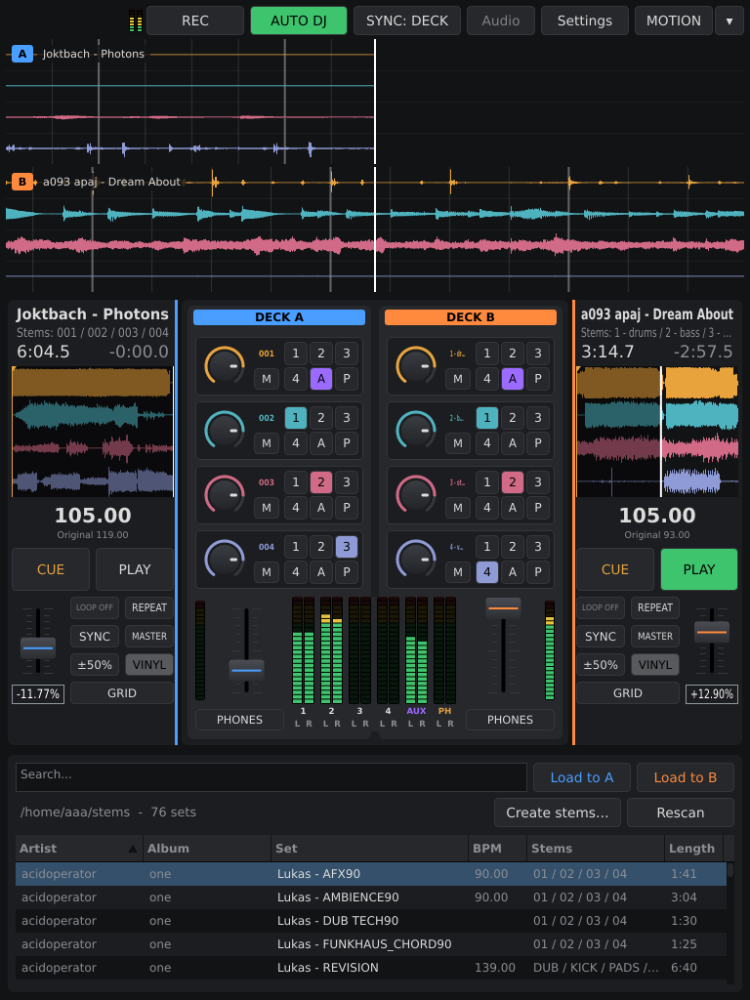
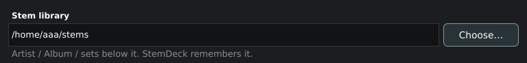
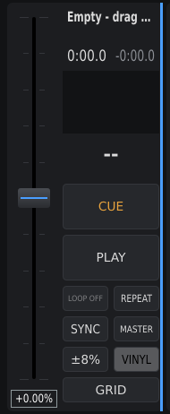
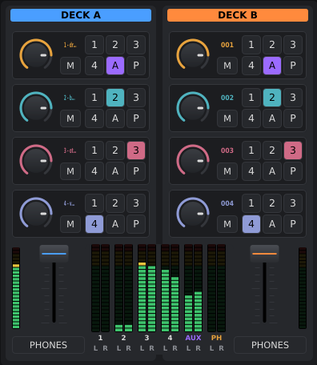
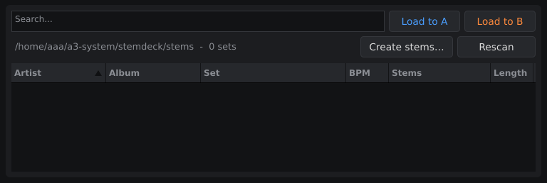

# StemDeck

(stemdeck-at-a-glance)=

## At a glance

StemDeck is a stem player for DJs: **two decks, each playing a track split
into four stems**, and a mixer that sends every stem to its own output. Where a
CDJ gives A³ Core a finished stereo mix, StemDeck gives it the parts — so the
drums can stay put while the pads fly round the room.

It runs on Linux, as a program with its own window, and plays into the JACK
graph. Its four stem buses and its aux bus go to A³ Core; a stem you send to
**aux** can be put onto a movement there and moved through the room by A³
Motion. A sixth bus, **CUE**, is for the headphones.

In the A³ system you can leave the screen alone: the A³ Mixer
[remote-controls StemDeck](#stemdeck-remote) through the Core.

On the A³ Core machine StemDeck is always there: a user service starts it
on its own i3 workspace, **STEMDECK** (number 2), filling the Core's
768 × 1024 portrait screen — see [Always running on the Core](#stemdeck-on-the-core).
A³ Motion is one tap away, on the key at the top right.

It can also be **the tempo master** of the whole system when there are no
CDJs in the booth: its master deck's beat goes out on Pro DJ Link, the
[beat-analyzer](beat-analyzer.md) follows it, and A³ Motion follows the
beat-analyzer.

A track you only have as a stereo file, StemDeck
[splits into stems](#stemdeck-stem-creator) itself.

```{tip}
**StemDeck is at its best with A³ Motion.** Each of its four stems arrives on
its own A³ channel, so the drums, the bass, the synths and the vocal can each
travel the room on their own path, in time with StemDeck's own beat. How to
wire it and a first set: [StemDeck × A³ Motion](stemdeck-with-motion.md).
```

- [StemDeck repository](https://github.com/rafjagger/stemdeck) — not under the
  `a3-audio` organisation, but carried by the a3-system repository along with
  the rest
- Built with JUCE



(stemdeck-stem-sets)=

## Stem sets

A **set** is exactly four audio files in one folder that share a name and
differ only in the part after the last space, `-` or `_`:

```text
Artist - Title-001.wav  …  Artist - Title-004.wav
Artist - Title - 01.wav …  Artist - Title - 04.wav
Artist - Title - DUB.wav, … - KICK.wav, … - PADS.wav, … - PERC.wav
```

The endings are sorted naturally — `01` before `10`, words alphabetically —
and stem N goes to bus N. A group of three or five files is not a set and
does not show up.

StemDeck reads WAV, AIFF, FLAC and Ogg Vorbis. WAV and AIFF are read straight
from disk as they are needed, which makes jumping and looping instant: for a
set you will loop, prefer those.

### Artist, album, set

Sort your stems into folders by artist and album — the library reads its
columns from them:

```text
stems/
├── Burial/
│   └── Untrue/
│       ├── Archangel - 01.wav … Archangel - 04.wav
│       └── Etched Headplate - Drums.flac … Etched Headplate - Vox.flac
└── Aphex Twin/
    └── Drukqs/
        └── CD1/
            └── Avril 14th - 1.wav … Avril 14th - 4.wav
```

The first folder under the library folder is the **artist**, the second the
**album**. Deeper folders are added to the album (`Drukqs / CD1`) — handy for
a double album. A set lying straight in the library folder has neither, one
level down only an artist. Inside a folder the rule above holds: four files
with the same beginning are one set, their endings sorted naturally
(`1 2 3 10`, `01 … 04`) or alphabetically.

The library looks through its folder and every folder below it. It starts in
`stems/`, next to where StemDeck was started, and remembers the last folder
you picked.

(stemdeck-screen)=

## The screen

Laid out for the Core's portrait screen: across the top, the scrolling
waveforms of both decks. In the middle, deck A, the mixer and deck B. At the
bottom, the library.

The top bar holds **REC**, **AUTO DJ**, the **SYNC** source, **Audio** (the
audio device; greyed out under JACK, where the routing is qjackctl's) and
**Settings** (where the stem library is), and at the right end the
workspace switch, **MOTION** and **▾** (see
[Over to A³ Motion](#stemdeck-workspaces)). Where the width leaves room it
also shows the audio status: JACK client, sample rate, buffer, connected
ports, xruns.


(stemdeck-workspaces)=

### Over to A³ Motion, and back

StemDeck and A³ Motion share the Core's screen, each on its own workspace.
The two keys at the right end of the top bar switch between them:

- **MOTION** shows A³ Motion. A³ Motion has the same switch, reading
  **STEMDECK**, at exactly the same place — so the key under your finger
  stays put, and tapping twice brings you back.
- **▾** opens a list of the rig's workspaces: MOTION, STEMDECK, REAPER,
  QJACKCTL, and SCARLETT while the Scarlett mixer runs. Only workspaces with
  a window on them are listed. The one on the screen is highlighted; tap
  another to go there, or tap beside the list to close it.

On REAPER, QJACKCTL and SCARLETT a bar at the top of the screen lists the
workspaces by name; tap STEMDECK or MOTION there to come back. The two touch
screens hide that bar, since they have their own switch.

(stemdeck-settings)=

### Settings



**Settings** holds one thing for now: the **stem library**, the folder the
library reads. **Choose…** picks it — it is chosen, never typed, because the
Core's touch screen has no keyboard. StemDeck remembers it.

(stemdeck-decks)=

### Decks



Laid out like a CDJ, without the platter: at 768 pixels a deck has no room
for a jog wheel, and the controller's wheels do that job (see the StemDeck
README for the Stanton SCS.3d).

| Control | What it does |
| :--- | :--- |
| **CUE** | as on a CDJ. While playing: back to the cue point, and stop. While stopped: sets the cue point here — or, if you are already on it, plays for as long as you hold it |
| **PLAY** | starts and pauses |
| **overview waveform** | the whole track, one lane per stem. Click to jump; drag to set a loop |
| **LOOP OFF** | clears the loop |
| **REPEAT** | starts the track over when it ends |
| **VINYL** | on: the controller's platter scratches, as a record would |
| **tempo fader** | at the deck's outer edge, with its range button, which steps ±8 / ±16 / ±50 % |
| **BPM** | the tempo as it plays now; below it, **Original**, the track's own tempo |
| **SYNC** | follows a leader — see [Sync](#stemdeck-sync) |
| **MASTER** | makes this deck the Pro DJ Link tempo master — see [StemDeck as the tempo master](#stemdeck-master) |
| **GRID** | Grid Adjust, as on a CDJ-3000, for a beat grid the analysis got wrong: the controller's jog moves the grid, and **SNAP** puts the downbeat on the cue point. The details are in the StemDeck README |

The tempo comes from an analysis that runs in the background when a set is
loaded. It sums the four stems and assumes the tempo does not change during
the track. The result is kept, so each set is analysed only once.

The scrolling waveforms at the top run past a fixed playhead: drag to move
through the track, turn the mouse wheel to zoom.

(stemdeck-mixer)=

### Mixer



One channel strip per deck, and per stem:

| Control | What it does |
| :--- | :--- |
| **gain knob** | −60 to +6 dB. Double-click for 0 dB |
| **M** | mutes the stem |
| **1 2 3 / 4 A C** | the six buses: 1–4, **A** for AUX and **C** for CUE, the headphones. A stem plays on every bus that is lit — any number at once, none for silence. A new set starts with stem N on bus N |

Buses 1–4 and AUX are **after the channel fader**; CUE is **before** it.
The six switches are StemDeck's own: the desk sets them through A³ Core and
StemDeck reports every change back, so the desk and this screen always agree.
Knob and mute act on all of them. Below the stems, the channel fader and
**CUE**, which puts the whole deck on the cue bus. Between the two
strips, the output meters for buses 1–4, AUX and CUE.

(stemdeck-library)=

### Library



One row per set: **Artist | Album | Set | BPM | Stems | Length** — artist and
album from the folders, BPM once analysed. It starts sorted artist → album →
set; click a header to sort by that column (artist and album keep their sets
together and in order). The search box finds sets by name, artist or album as
you type.

To load a set:

- **Load to A** / **Load to B**, or
- double-click the row, or press Return — it goes to the first deck that is
  not playing, or
- drag the row onto a deck or its waveform.

**Rescan** looks through the folder again. The folder itself is chosen in
[Settings](#stemdeck-settings). The line above the table shows it and how
many sets it holds.

(stemdeck-keys)=

### Keys

| | Deck A | Deck B |
| :--- | :---: | :---: |
| Play / pause | `D` | `L` |
| Cue (hold to preview) | `S` | `K` |
| Mute stem 1–4 | `1` `2` `3` `4` | `7` `8` `9` `0` |

(stemdeck-stem-creator)=

## Making stems from a stereo track

Only have the finished mix? StemDeck splits it into four stems itself —
drums, bass, other, vocals — and files the result in the library as a set.

<!-- IMAGE: the "Create stems" question with its Target folder field, and the strip under the library bar showing a running job, e.g. "Stems: Title  42 %  +2 waiting". Not taken: both need files dropped on the rig's running StemDeck. -->

### Starting

- Drop stereo files, or a whole folder, onto the library, or
- press **Create stems…** in the library bar.

FLAC, WAV, MP3, AIFF, OGG, M4A and Opus work.

StemDeck asks once for the whole batch: the **Target folder**, relative to
the library — typed (`Artist/Album`), picked with **Browse…**, or left empty
for the library folder itself. It comes preset from where the files lie:
`Artist/Album` for `…/Artist/Album/*.flac`, only `Artist` when they come
from several of its albums. **Create** starts, **Cancel** leaves it. Every
track of the batch lands in that one folder.

### What you get

Each track becomes a set in the target folder:

```text
stems/
└── Artist/
    └── Album/
        ├── Title - 1 - drums.flac
        ├── Title - 2 - bass.flac
        ├── Title - 3 - other.flac
        ├── Title - 4 - vocals.flac
        └── originals/
            └── Title.flac
```

- Stem N lands on bus N: drums on 1, bass on 2, other on 3, vocals on 4.
- `originals/` holds a **copy** of the file you dropped. The library does not
  look in there, so the original never turns up as a set.
- The title is the file name without its extension.
- The stems keep the original's format: FLAC, WAV and AIFF at 24 bit, Ogg
  Vorbis at quality 8. MP3, M4A and Opus become FLAC — StemDeck can't play
  those, and FLAC loses nothing a second time. For a set you will loop,
  WAV or AIFF are the quick kind to jump in.
- If the album already has a track of that name, the new one is called
  `Title (2)`.
- When a set is done, the library scans again and selects it.

### While it works

The splitting is done by [Demucs](https://github.com/adefossez/demucs)
(`htdemucs`, 44.1 kHz). It runs in the background, one track at a time; the
others queue up.

**It runs while the decks play.** StemDeck's audio thread has CPU 1 to
itself; the separator takes every other core (`0,2-5` on six) at idle
priority for CPU and disk, with at most 6 GB of memory. To leave it fewer
cores, set `<VALUE name="separatorCores" val="1"/>` in
`~/.config/StemDeck/StemDeck.settings` (1 is CPU 0 only; a track then takes
about 1.2 × its length).

The strip under the library bar shows the track, its progress and how many
tracks wait (`+2 waiting`). If a track fails, the strip says why
(`Stems: failed: …`), until you add the next one; the rest of the queue
carries on.

**Cancel** in the strip stops the running track and leaves nothing
behind — no half set in the album.

(stemdeck-stem-creator-setup)=

### Setting it up, once

The separator is not part of StemDeck; it is set up once per machine and
takes about 1 GB. In the StemDeck checkout:

```sh
sudo apt install ffmpeg python3-venv
tools/setup-separator.sh
```

The script installs Demucs and the CPU build of PyTorch into
`~/.local/share/StemDeck/separator` and downloads the model. Without it, a
job fails straight away and the strip says `separator not installed`.

(stemdeck-remote)=

### Remote control from the desk

With A³ Core running, the A³ Mixer chooses what is on its channels: turn a
channel's encoder to a deck, push to enter it, then turn to a stem and push to
load it. What the desk displays,
and the rules for it, are on the
{ref}`desk's stem displays <a3mix-displays>`. From StemDeck's side:

- **StemDeck keeps the truth.** Core only relays the desk's request to switch a
  bus and asks StemDeck for all switches when it hears StemDeck for the first
  time. A click on a bus switch here also shows on the desk.
- **One stem per channel.** A channel plays one stem, and a stem plays on one
  channel at most. If a session shows several stems on one bus, Core keeps the
  lowest and switches the others off, about 0.3 s after your reports settle.
- **AUX follows the return's mode.** In STEM mode every stem no channel plays
  has its **A** lit, and Core switches a free stem's A back on if you click it
  off. In ANALOG mode no stem is on AUX. A stem loaded on a channel loses its
  A.
- **Core sets the C switches.** A stem's **C** is on while it plays on a cued
  desk channel and off otherwise; Core sets them at every cue change, push and
  report, so a C clicked on StemDeck's own screen is switched back. A push of
  another stem moves the C along; with the channel on analog, all C switches
  are off. See {ref}`the cue <a3mix-cue>`.
- **StemDeck says hello to Core every 30 seconds**, and Core learns its
  address from that. StemDeck listens on UDP port 7780.
- **A fresh StemDeck starts with every stem on AUX only**, on no desk channel,
  so it takes no channel and no analog input goes silent. A session saved
  before this change restores its own switches.
- **Stem meters.** StemDeck sends one meter per stem to the desk only
  (deck A stems 1–4 are `/vu/41`–`/vu/44`, deck B `/vu/45`–`/vu/48`), 25 times
  a second. Each is measured after the stem's knob and mute, before the fader
  and the buses.

(stemdeck-audio)=

## Audio out

StemDeck is a JACK client named `StemDeck`. Its ports (the twelve
outputs, what is on each, and the `rec_L` / `rec_R` inputs that feed **REC**
in the top bar, which writes a 24-bit FLAC to `recordings/` next to `stems/`)
and where they arrive on A³ Core are all on the
{doc}`Patchbay page <../ressources/patchbay>`. Despite the names,
`deck1` … `deck4` are the **buses**, one per stem position, not the decks.

- **Nothing is connected automatically.** Patch the ports yourself, in
  qjackctl or any other patchbay. On the Core, the a3-core package's patchbay
  does it; how to wire a StemDeck on another machine is on
  [StemDeck × A³ Motion](#stemdeck-with-motion-map).
- **In the A³ setup each bus is an A³ channel.** Bus N arrives on A³ Core's
  channel N, the channel A³ Motion moves as channel N; aux arrives on Core's
  Return track.
- StemDeck **never starts a JACK server**. It uses the one that is running,
  or PipeWire's JACK interface; with neither, it falls back to a plain audio
  device (ALSA), chosen with **Audio**. With fewer than twelve outputs
  there, the buses are summed down onto the ones there are.
- **There is one output mode:** the six stereo buses, twelve JACK ports
  (`deck1_L` … `phones_R`). The earlier "8× stereo (external routing)" mode
  and its setting are gone.
- It takes the graph's sample rate and buffer size as they are, and resamples
  the stems itself. It asks for nothing on purpose: changing a running graph
  throws out other clients (zita-j2n, for one). If the rate matters, set it
  before starting — for PipeWire, until its next restart:

  ```sh
  pw-metadata -n settings 0 clock.force-rate 44100
  ```

<!-- NOTE: audio I/O (ports, REAPER inputs, zita channels) is documented once, on the Patchbay page (src/ressources/patchbay.md). The REAPER template routes the zita-n2j track: pairs 1-2 .. 7-8 -> 1-input .. 4-input, 9-10 -> Return, 11-12 unused. -->

(stemdeck-sync)=

## Sync

<!-- IMAGE: the top bar under SYNC: PIO, with the PIO status readout (e.g. "PIO 128.0 · CDJ 2") and the player box. Not taken: switching SYNC on the rig's running StemDeck turns off every SYNC that was on. The top bar as it is, under SYNC: DECK, is under "The screen" above. -->

**SYNC** on a deck makes it follow a leader. The **SYNC: DECK | PIO** button
in the top bar chooses which leader: the other deck, or the CDJs. Switching it
turns off every SYNC that was on.

Both follow by the same rules:

- **Tempo:** the leader's tempo times a half, one or two — whichever needs the
  smallest change, chosen once when SYNC goes on. The tempo fader's range
  widens if it has to.
- **Phase:** corrected only while both play and nobody is scratching. More
  than 50 ms off, the deck jumps into phase; closer, it is nudged, by at most
  2 %.

### DECK: one deck follows the other

SYNC on deck A makes A follow B. Pressing SYNC on B hands the role over: B
follows A.

(stemdeck-pio)=

### PIO: following the CDJs

SYNC follows the **Pro DJ Link tempo master**: its tempo, pitch included, and
its beat. Both decks may follow at once, each with its own half/one/two.

- StemDeck joins the link as **virtual CDJ 6** and listens on UDP ports
  50000–50002, which it reads from the A³ system's `a3-osc.json` (see
  {ref}`Where addresses and ports live <osc-truth>`). On the Core machine that
  file comes from Core itself: StemDeck follows it, and when the truth changes
  its window closes and reopens once (about 5 s) — see
  {ref}`Following Core <osc-follow>`. Without any truth the PIO clock does not
  start and its status line says `PIO: no a3-osc.json`.
  It shares those ports, so it can run on the same machine as the
  beat-analyzer (virtual CDJ 7), and both get the beats. If the network is not
  up yet, it tries again every two seconds.
- It learns who is master from the players' status packets. Some of those are
  sent to one address only, so on a machine it shares with the beat-analyzer
  they may not arrive. After two seconds without them the readout says **no
  master**, and StemDeck follows the player chosen in the box beside it — by
  default the first one it heard.
- If the master falls silent, the tempo is held (the readout says **held**)
  and the phase is left alone until beats come back.
- It lines up the **beat, not the bar**: the track's grid knows beats, not
  where the one is. Put the downbeat right with the jog, as on a CDJ.

The player number is the setting `pioDevice` in
`~/.config/StemDeck/StemDeck.settings`.

(stemdeck-master)=

## MASTER: StemDeck as the tempo master

No CDJs on the link? Then StemDeck is the CDJ. Each deck has a **MASTER**
button, as a CDJ has: the master deck's beat goes out on the Pro DJ Link
network, and whatever follows the link's tempo master follows StemDeck. In the
A³ system that is the beat-analyzer in clock mode 2, and through it A³ Motion
on **PIO**. The whole chain is on the beat-analyzer's page:
{ref}`Playing without CDJs <beat-analyzer-without-cdjs>`.

- **Press MASTER** on a deck to make it master; on the other deck, to hand
  over; on the master, to turn MASTER off. With MASTER off and SYNC not on
  PIO, StemDeck leaves the network.
- **With no master chosen, the only playing deck becomes master by itself** —
  except under SYNC: PIO, where a real CDJ may hold master and two masters
  would pull every listener back and forth, and except after you turned
  MASTER off by hand.
- **What goes out**, as virtual CDJ 6: a **beat packet on every beat** of the
  master deck — tempo is the track's BPM times the tempo fader, the beat in
  the bar counted from the first beat of the grid — and a **status packet
  every 200 ms**: master, playing or not, tempo, beat.
- **A stopped master stays master** and simply sends no beats.
- **Nothing goes out while the master deck has no tempo yet** — its analysis
  is still running.
- Everything goes out as **broadcast**, on the first network interface that
  is up, can broadcast and is not the loopback. So a listener on the same
  machine gets it, whichever program started first.
- The beats are timed to about a millisecond, on a thread of their own, not
  by the screen. A beat is not lost to a late wake-up, a cue on a beat sends
  that beat when you press PLAY, a jump does not send a burst of the beats
  skipped, and a handover never sends a beat twice.
- The top bar reads `PIO master: A` (or B) while StemDeck sends.

The packets are laid out the way
[prolink-connect](https://github.com/EvanPurkhiser/prolink-connect) reads
them, so tools built on it see StemDeck as a CDJ.

(stemdeck-build)=

## Build and start

StemDeck is built from source, on Linux. It needs:

- CMake 3.22 or newer, a C++17 compiler, pkg-config
- **JUCE 9**, installed so that CMake finds it, plus JUCE's own Linux build
  dependencies. `start.sh` looks for it under `~/local/juce` unless
  `CMAKE_PREFIX_PATH` says otherwise
- JACK, FLAC, Vorbis and Ogg development files. On Debian:

  ```sh
  apt install libjack-jackd2-dev libflac-dev libvorbis-dev libogg-dev
  ```

- GoogleTest (`libgtest-dev`), only for the tests

Then, in the StemDeck checkout:

```sh
./start.sh
```

The first run configures a Release build in `build/`; every run after that
rebuilds what changed and starts StemDeck — through a running JACK server,
through PipeWire's `pw-jack` if there is no JACK server but PipeWire runs, or
on ALSA. The program itself is `build/StemDeck_artefacts/Release/StemDeck`.

The settings — the library folder, the SYNC source, the audio device, the
player number — live in `~/.config/StemDeck/`, next to `analysis.xml`, the
kept tempo analyses. An analysis is kept per file, size and date, so a stem
file that changes is analysed again; to analyse everything anew, delete
`analysis.xml` while StemDeck is closed.

(stemdeck-on-the-core)=

### Always running on the Core

On the A³ Core machine StemDeck runs as a user service and sits alone on i3
workspace `2:STEMDECK`, filling it. The rules are in the a3-core package's
i3 config: the main window is tiled without a border rather than put in i3's
full screen, because every dialog StemDeck opened ended full screen; all its
other windows — Settings, Audio, Create stems, the folder choosers, message
boxes — float over it. From the StemDeck checkout:

```sh
cp .config/systemd/user/stemdeck.service ~/.config/systemd/user/
systemctl --user daemon-reload
systemctl --user enable --now stemdeck
```

It starts the build in `build-make/` of that checkout, so a rebuild is picked
up by `systemctl --user restart stemdeck`.

A (re)start takes the screen for a moment: JUCE builds the window more than
once as it comes up, and the first one takes the focus. The service therefore
runs `tools/rig-keep-the-screen.sh` around the start — it remembers the
workspace that was showing and switches back to it once StemDeck's main
window is there, so A³ Motion stays on the screen if it was.

```{warning}
**Do not restart StemDeck mid-set.** Its JACK client leaving and joining
changes the audio graph, and that costs a burst of JACK xruns — audible
clicks on everything the Core plays. Restart it between sets.
```

Demo and promo videos are recorded with OBS Studio, outside StemDeck.

(stemdeck-troubleshooting)=

## Troubleshooting

| Symptom | What to do |
| :--- | :--- |
| A set is missing from the library | It needs exactly four files with one name and different endings. **Rescan** after adding files. Is the library the folder you think? See [Settings](#stemdeck-settings) |
| The stem strip says `separator not installed` | Run the one-time setup: [Setting it up, once](#stemdeck-stem-creator-setup) |
| Making stems is slow | It runs at idle priority on the cores StemDeck leaves it, so a busy machine slows it down. `separatorCores` sets how many it may take |
| Nothing to hear | The ports are never connected automatically. Patch them in qjackctl |
| The top bar says `JACK-Server wurde beendet` | JACK went away under StemDeck. Restart StemDeck once JACK is back |
| A stem does not move | Its A³ channel's **3d** has to be up and its clip playing. A stem only on **A** (AUX) is on Core's Return track, not on a channel — light its bus number again. See [StemDeck × A³ Motion](#stemdeck-with-motion-troubleshooting) |
| MASTER is on, but A³ Motion does not follow | Wait for the deck's BPM: nothing goes out before its analysis is done. Is the deck playing? Is A³ Motion on **PIO**? |
| The downbeat on A³ Motion is on the wrong beat | StemDeck counts the bar from the grid's first beat. Set CUE on the real first beat of a bar and press **GRID**, then **SNAP** |
| The PIO status line says `PIO: no a3-osc.json` | StemDeck found no truth: not `$A3_OSC_TRUTH`, not the cache `~/.cache/a3/a3-osc.json`, not `/usr/share/a3/a3-osc.json`, where it reads its Pro DJ Link ports. On the Core the a3-core package installs the last one, and Core's announcement fills the cache |
| SYNC: PIO says **no master** | The status packets don't reach StemDeck. It follows the player chosen in the box beside the readout instead |
