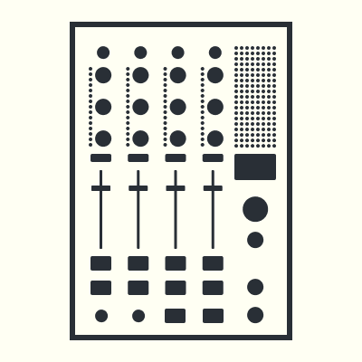
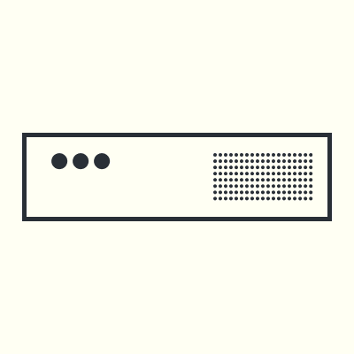

# User Welcome
## A³ System
- [A³ System](https://a3-audio.github.io/a3-doc/assembly/assembly.html) are the three devices A³ Core, A³ Motion and A³ Mixer. They are connected via network cable to an ethernet switch which deliveres power over ethernet (PoE)
- Your DJ-Decks, Heapdphones and speakers for Booth and Main are connected to A³ Core's audiohardware
- Take a look at [Assembly section](https://a3-audio.github.io/a3-doc/assembly/assembly.html) for prototype pictures

## A³ Motion (The Motion Sampler)
[A³ Motion](https://a3-audio.github.io/a3-doc/user/a3motion.html) is a standalone OSC controller which works like a loopstation, but instead of audio it lets you sample and playback motion from a touchscreen.

## A³ Mix (The DJ Mixer)
[A³ Mix](https://a3-audio.github.io/a3-doc/user/a3mix.html) is a standalone OSC controller which behaves like a 4 channel DJ mixer.

## A³ Core (The Sound Server)
[A³ Core](https://a3-audio.github.io/a3-doc/user/a3core.html) processes analog audiosignals, calculates 3D audio spheres and is remote controlled by A³ Mix and A³ Motion (or any other OSC controller). A³ Core can handle a wide range of audio hardware to fit environments like Dante, MADI or any class-compliant.

## Requirements
- PA soundsystem with at least 4 speakers    
- A venue smaller than 18m diameter. For bigger venues more speaker spheres are required
## Optional
- Booth soundsystem with at least 4 speakers placed around the DJ desk
## Quickstart
- Plug in your instruments vinyl, cd, daw ..    
- Plug in your speakers    
- Put speakers in regular circle around center    
- Plug CAT cable from A³ Mix and A³ Motion to A³ Core    
- Plug in your headphones    
- Power on
