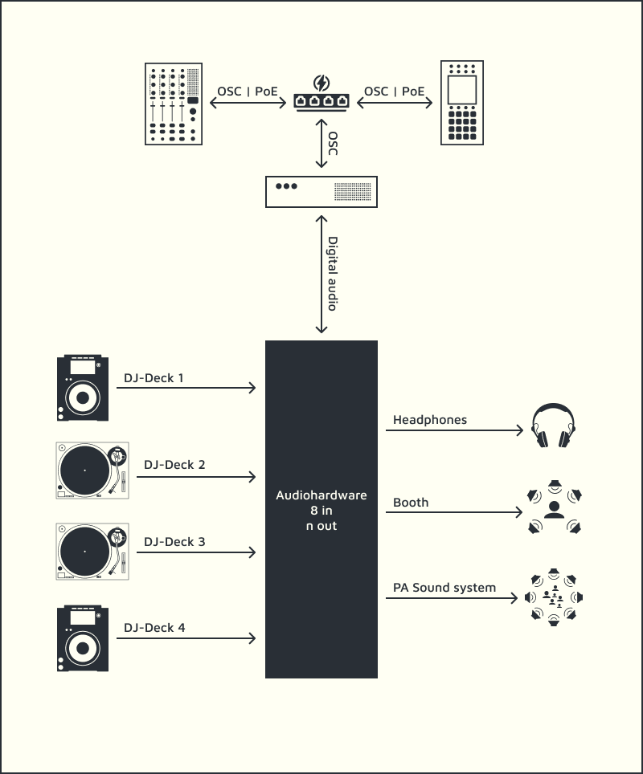
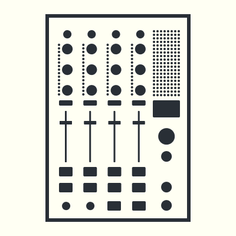
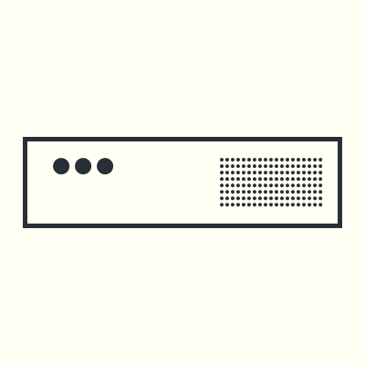

# Welcome
## A³ System

- [A³ System Repository](https://github.com/a3-audio/a3-system)
- The A³ System is the three devices A³ Core, A³ Motion and A³ Mixer. They are connected to one ethernet switch which also delivers their power (PoE), and they talk to each other exclusively over OSC
- Your DJ decks, headphones and the booth and main speakers are connected to A³ Core's audio hardware
- Take a look at the Assembly section for prototype pictures
- Take a look at [History (Assembly)](https://a3-audio.github.io/a3-doc/ressources/history.html) for project impression pictures

## A³ Motion (The Motion Sampler)
[A³ Motion](https://a3-audio.github.io/a3-doc/user/a3motion.html) is a standalone OSC controller which works like a loopstation, but instead of audio it lets you sample and playback motion from a touchscreen.

## A³ Mix (The DJ Mixer)
[A³ Mix](https://a3-audio.github.io/a3-doc/user/a3mix.html) is a standalone OSC controller which behaves like a 4 channel DJ mixer.

## A³ Core (The Sound Server)
[A³ Core](https://a3-audio.github.io/a3-doc/user/a3core.html) processes analog audiosignals, calculates 3D audio spheres and is remote controlled by A³ Mix and A³ Motion (or any other OSC controller). A³ Core can handle a wide range of audio hardware to fit environments like Dante, MADI or any class-compliant.

Because the three devices talk over OSC rather than through each other, there
is only ever **one** state, and every device is told all of it. Turn a knob on
the A³ Mixer and A³ Motion's screen follows; move a fader in the Core's own
mixer and both of them follow. A device that has just been switched on asks
what is already sounding before it says anything, so nothing jumps when it
joins.

The same feed can be given to anything else — a light or video desk, say — by
naming it when the Core starts. See
[A³ Core Configuration](https://a3-audio.github.io/a3-doc/configuration/core.html).

The Core also runs the **Beat-Analyzer**, which listens to the music and produces
the tempo the whole system follows, together with the VU meters shown on the other
two devices. Its clock can come from its own analysis, from A³ Motion's tap button,
or from a Pioneer Pro DJ Link master.

