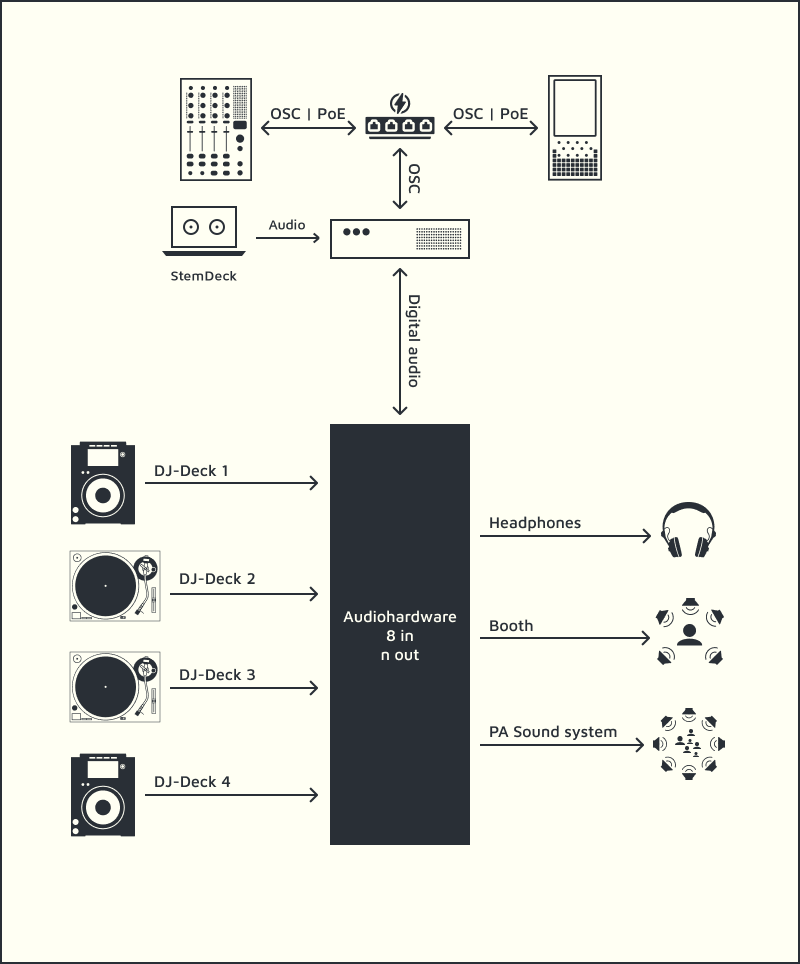
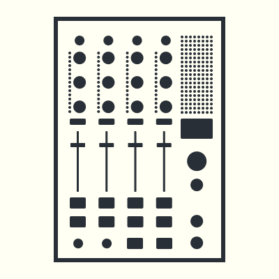
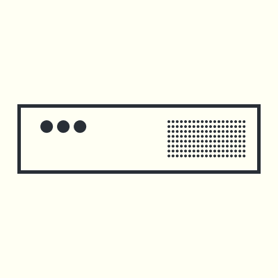

# Welcome

## The A³ System

```{tip}
**New here?** Start with A³ Motion's
[first ten minutes](#motion-get-started), and keep
[On stage](a3motion-on-stage.md) open before your first gig.
```

Three devices on one network, talking **only OSC**
({doc}`ports <../ressources/ports>`):

| Device | What it is | What it does |
| :--- | :--- | :--- |
| [**A³ Core**](a3core.md) | the sound server | takes the audio in, computes the 3D field, sends it out; remote controlled |
| [**A³ Mixer**](a3mix.md) | a 4-channel DJ mixer | gain, EQ, filter, faders, cue, all as OSC |
| [**A³ Motion**](a3motion.md) | the motion sampler | a loopstation for *where a sound is* |

All audio — decks, phones, booth, main — connects to A³ Core. Two programs
belong too:

| Program | What it is | What it does |
| :--- | :--- | :--- |
| [**Beat Analyzer**](beat-analyzer.md) | the beat clock | on the Core: the beat and the level meters for every device |
| [**StemDeck**](stemdeck.md) | a stem player | two decks of four stems, each on its own output, so one part can move alone; tempo master without CDJs |

```{tip}
**StemDeck × A³ Motion.** Put StemDeck's four stems on A³ Motion's four
channels and let the drums, the bass, the synths and the vocal each travel the
room on their own path — in time with the track, because StemDeck is the
clock. See [StemDeck × A³ Motion](stemdeck-with-motion.md).
```



## One state, told to everyone

Because the devices talk over OSC rather than through each other, there is only
ever **one** state, and every device is told all of it.

| What you do | What follows |
| :--- | :--- |
| turn a knob on the A³ Mixer | A³ Motion's screen follows |
| move a fader in Core's own mixer | both devices follow |
| switch a device on mid-evening | it asks what is already sounding before it says anything, so nothing jumps |

The same feed can be given to anything else — a light or video desk, say — by
naming it when the Core starts. See
{ref}`Adding a department <core-subscriber>`.

## The beat

The [**Beat Analyzer**](beat-analyzer.md) on A³ Core sends the tempo every
device follows, and the meters they show. Its clock comes from A³ Motion's own
tempo, from the music, or from a Pro DJ Link tempo master — a CDJ, or
[StemDeck](stemdeck.md). Everything that moves on its own counts in **bars**,
so a four-bar figure stays four bars when the tempo changes.

## Where to go next

| Section | What is in it |
| :--- | :--- |
| **User** | the three devices, control by control — start here — and the beat analyzer and StemDeck |
| [**Repository**](https://github.com/a3-audio/a3-system) | the umbrella repository that carries all the others |
| **Assembly** | prototype pictures and how the boxes go together |
| **Configuration** | {doc}`installing the system <../configuration/install>`, each device's hardware, and the files each device reads at startup |
| **Development** | building and hacking on the software |
| [**History**](https://a3-audio.github.io/a3-doc/ressources/history.html) | project impressions |
| [**OSC reference**](https://a3-audio.github.io/a3-doc/ressources/osc.html) | every address the system speaks |





