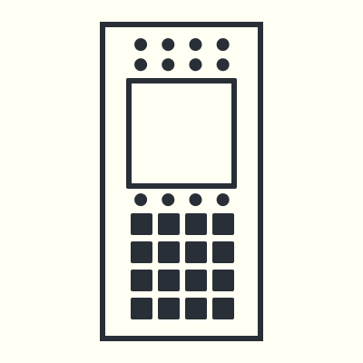

# Welcome
## A³ System

- [A³ System Repository](https://github.com/a3-audio/a3-system)
- A³ System  are the three devices A³ Core, A³ Motion and A³ Mixer. They are connected via network to an ethernet switch which deliveres power over ethernet (PoE)
- Your DJ-Decks, Heapdphones and speakers for Booth and Main are connected to A³ Core's audiohardware
- Take a look at Assembly section for prototype pictures
- Take a look at [History (Assembly)](https://a3-audio.github.io/a3-doc/ressources/history.html) for project impression pictures

## A³ Motion (The Motion Sampler)
[A³ Motion](https://a3-audio.github.io/a3-doc/user/a3motion.html) is a standalone OSC controller which works like a loopstation, but instead of audio it lets you sample and playback motion from a touchscreen.

## A³ Mix (The DJ Mixer)
[A³ Mix](https://a3-audio.github.io/a3-doc/user/a3mix.html) is a standalone OSC controller which behaves like a 4 channel DJ mixer.

## A³ Core (The Sound Server)
[A³ Core](https://a3-audio.github.io/a3-doc/user/a3core.html) processes analog audiosignals, calculates 3D audio spheres and is remote controlled by A³ Mix and A³ Motion (or any other OSC controller). A³ Core can handle a wide range of audio hardware to fit environments like Dante, MADI or any class-compliant.

